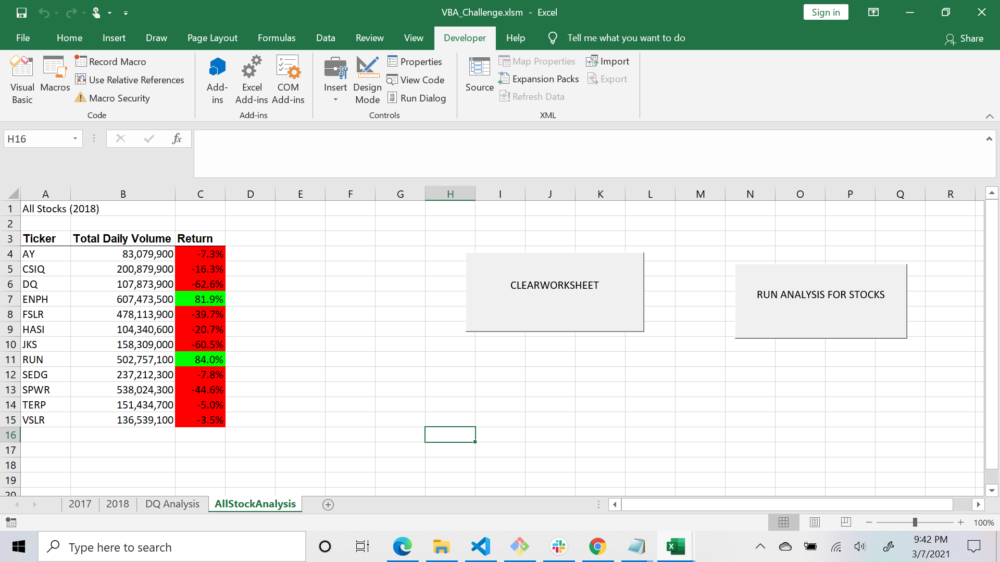
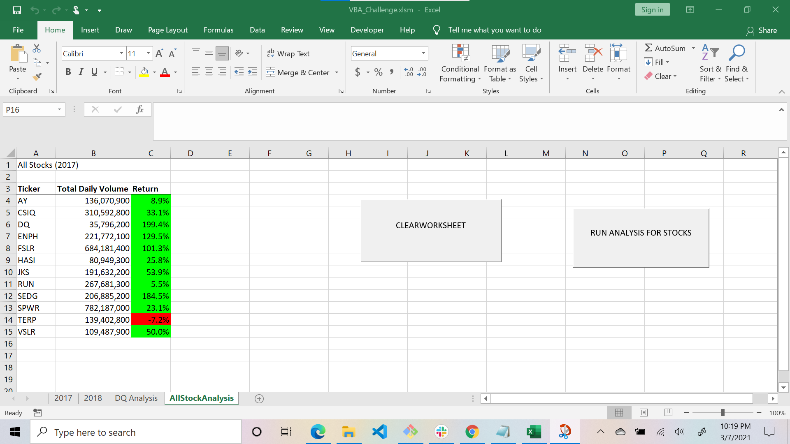

# stock-analysis
## Analysis and Challenges
2017 and 2018 stocks were analysed by looping through the volumes colum of both years.
Then getting an aggregate of the volume for each ticker.
The return value of the stocks for both the years were calculated by dividing  the ending and 
starting price for each ticker . 
 

### Challenges and Difficulties Encountered
1. Removed the line  > Worksheets("2018").Activate as we are doing analysis for years 2017 and 2018

2. Removed  if statement while incrementing tickervolume
 
3. Learning to use arrays instead of variable like <  tickers(tickerindex) instead of just **tickers**

4. the output dispalying 2 timings , one for the whole year and one with seconds was not solvable
or comprehendable

## Results

In 2018 the only  stocks which can be recommended to steve's parents are **ENPH** and **RUN**

 
In 2017 all the stocks can be recommended to steve's parents except ** TERP **

There is a noticable difference time taken to run the code for unfactored and refactored stock analysis
for both years 
for 2017 a difference of approximately it is 8086 seconds  for year and stock returns also have varied
for 2018 a difference of approximately it is 81046 seconds for the year 

